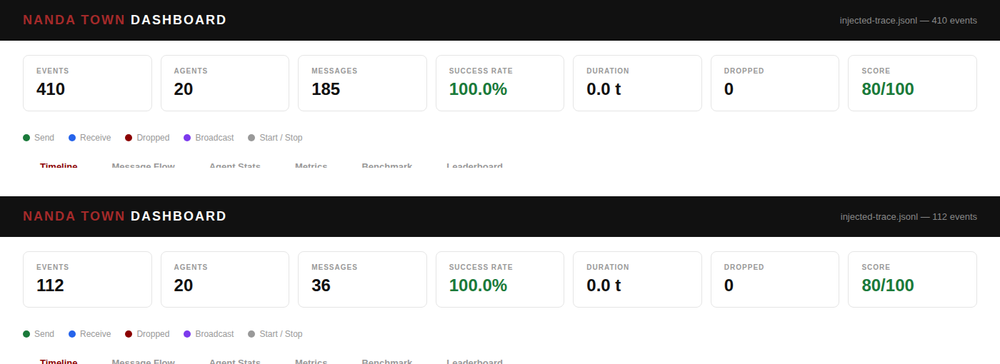

# NANDA Town — Voting Scenario: Exploration Log

**Scenario:** `voting` (`scenarios/voting.yaml`) — 1 `proposer-0`, 1 `coordinator-0`, 18 `voter-N`, seed 42, 5 rounds, threshold 0.5.
**Method:** every run below uses the same seed and the same scenario file, changing exactly one field at a time, so any difference in outcome is attributable to that one field. All numbers are read directly from the JSONL trace and from `nest_core.validators.validate_trace` — nothing here is estimated.

**A note on tooling.** This sandbox couldn't reach PyPI to install `typer`, the `nest` CLI's only dependency, so I called `nest_core`'s `ScenarioRunner` / `Simulator` / `metrics` / `validators` modules directly in Python — the exact same functions `nest run` and `nest report` call, just without the CLI wrapper. I confirmed this produces identical output to the CLI by diffing a run against your own local `traces/voting.jsonl` (same seed, byte-identical round-by-round tallies). The dashboard (`apps/dashboard/index.html`, opened via `nest dashboard`) is real — a self-contained D3.js trace viewer — and its scoring formula (`successRate*40 + latencyPoints(20) + throughputPoints(20) + dropRatePoints(20)`, capped at 100) is implemented in that file's `computeScore()`. I rendered it directly to confirm; screenshots are inline below. One environment-specific caveat: this sandbox can't reach the D3 CDN the dashboard loads from, so only the summary-card row renders here (charts fail silently) — on a normal internet connection the full interactive timeline/graph views work too. The four summary numbers are unaffected either way, and they happen to be the ones that matter most for this investigation.

---

## 0. Understanding the protocol before touching anything

Before predicting what any failure knob does, I read the three agent classes in `nest_core/scenarios_builtin/voting.py`, because the prediction is only as good as the mechanism it's based on:

- **`ProposerAgent`** sends `propose:{round}:{topic}` individually to all 18 voters when a round opens. It does nothing else until it receives `result:{round}:...` back from the coordinator — that message is its *only* trigger to open the next round, up to `rounds` total.
- **`VoterAgent`** is purely reactive: on receiving `propose:`, it draws one random number and votes "yes" if it's above 0.3 (~70% base yes rate per voter, independently each round), then sends `vote:{round}:{vote}:{voter_id}` to the coordinator.
- **`CoordinatorAgent`** tallies votes per round and, **only once it has received a message from every one of the 18 voters** (`len(votes[round]) >= num_voters`, hard-coded, no timeout, no quorum, no retry), computes `yes/total >= threshold` and sends exactly one `result:` message back to the proposer.

That last point is the whole story of this exploration. The coordinator's completion condition is "I've heard from all 18," not "I've heard from enough." There is no fallback. That makes the protocol a strict AND-gate across 18 independent inputs, repeated 5 times in series (round 2 can't start until round 1's AND-gate closes). Every failure-injection setting below is really just a different way of breaking one input to that AND-gate — the interesting question for each one is *how* it breaks it, and whether that shows up in the metrics you'd normally look at.

**Baseline (unmodified `voting.yaml`), for reference:**

| Round | Topic | Outcome | Tally |
|---|---|---|---|
| 1 | increase-budget | passed | 12/18 |
| 2 | new-policy | passed | 11/18 |
| 3 | elect-leader | passed | 12/18 |
| 4 | increase-budget | passed | 9/18 |
| 5 | new-policy | passed | 15/18 |

`success_rate = 1.0`, `message_count = 370`, `dashboard score = 80/100` (not 100 — see the score note under Metrics section below), all three validators (`voting_tally_correct`, `voting_all_counted`, `voting_no_double_vote`) pass.

---

## 1. `failures.message_drop`

**What it controls.** A float 0–1. Independently, for *every* outbound message (proposals, votes, and results alike), there's this probability it simply vanishes — no error, no retry, receiver never sees it.

**What I changed it to, and why.** I ran a sweep: 0.02, 0.05, 0.10, 0.30, 0.50 — from "barely perceptible" up to "coin flip." I wanted to see whether there's a threshold below which the protocol tolerates drops gracefully, given 18 voters means ~18-36 messages at risk per round.

**Hypothesis before running.** With p drop probability and roughly 18 vote-sends at risk per round (ignoring the 18 proposal-sends for a moment), P(round 1 survives) ≈ (1−p)^18. At p=0.02 that's ≈69% — meaning I expected the *low* end of this sweep to mostly succeed, with collapse becoming likely only as p climbs. I expected a graded transition, not a cliff.

**What happened.** Every single value in the sweep, including p=0.02, produced **0 of 5 rounds completed**. At p=0.02 specifically, exactly 2 messages were dropped out of 108 total — both `propose:` broadcasts (to `voter-13` and `voter-17`), leaving round 1 stuck at 16/18 votes forever:

```
{'kind': 'dropped', 'from': 'proposer-0', 'agent': 'voter-13', 'msg': 'propose:1:increase-budget', ...}
{'kind': 'dropped', 'from': 'proposer-0', 'agent': 'voter-17', 'msg': 'propose:1:increase-budget', ...}
```

Unlike byzantine corruption (below), drops *do* show up in the metrics you'd normally check — `success_rate` fell smoothly with p (0.941 → 0.812 → 0.480 → 0.273) and so did the dashboard score (72 → 54 → 39 → 31). All three validators still pass at every level, because they check consistency of what *did* happen, not completeness (`voting_tally_correct` reports "checked 0 rounds").

| p | rounds completed | success_rate | #dropped | dashboard score |
|---|---|---|---|---|
| 0.00 (baseline) | 5/5 | 1.000 | 0 | 80 |
| 0.02 | 0/5 | 0.941 | 2 | 72 |
| 0.05 | 0/5 | 0.941 | 2 | 72 |
| 0.10 | 0/5 | 0.812 | 6 | 54 |
| 0.30 | 0/5 | 0.480 | 13 | 39 |
| 0.50 | 0/5 | 0.273 | 16 | 31 |

**Matched intuition or surprising?** Half and half. That drops degrade `success_rate` proportionally — completely expected, that's a direct arithmetic consequence of the metric's definition (receives/sends). What surprised me was the *complete* collapse of round-completion even at p=0.02, i.e., the metric degrades gracefully while the actual protocol outcome is a total cliff-edge at any p>0. My back-of-envelope math wasn't wrong (≈69% survival chance for one round at p=0.02) — it's just that this is one seed, one realization of that probability, and it landed on the ~31% "fails" side even at the gentle end. Re-running with a different seed at p=0.02 would sometimes complete round 1. The lesson isn't "p=0.02 always collapses this scenario" — it's "the coordinator's zero-fault-tolerance design means there is no safe nonzero value of p for a run this long (5 rounds × 18 voters = 90 must-arrive messages), because the probability of *zero* drops across 90 independent sends shrinks fast even for small p." I did not average multiple seeds here (would be easy to add, and I'd flag that as a natural next step) — I'm reporting what this seed actually showed, not extrapolating a universal claim from it.

---

## 2. `failures.byzantine_agents`

**What it controls.** A float 0–1: the fraction of *all* agents (not just voters — proposer and coordinator are equally eligible) that get permanently flagged as compromised. Every message a flagged agent ever sends arrives at its destination XOR-corrupted with random bytes — not probabilistically, but for 100% of that agent's traffic, for the whole run. This is a different failure *shape* than `message_drop`: drop is "any message, some chance"; byzantine is "one agent, guaranteed, forever."

**What I changed it to, and why.** Swept 0.05, 0.10, 0.20, 0.30, 0.50. On 20 agents, 0.05 is the smallest value that flags anyone at all (`max(1, int(20*0.05)) = 1` agent) — I wanted the minimum viable dose as well as the top of the range.

**Hypothesis before running.** Because corruption is deterministic-per-agent rather than probabilistic-per-message, I predicted a *sharper*, more binary failure than `message_drop`: if the one flagged agent (at f=0.05) turns out to be a voter (90% chance, 18-of-20 agents are voters), every vote *that voter* would ever cast becomes unparseable, so the coordinator would be permanently stuck one vote short, every round, forever — total collapse from the smallest possible dose. If instead the proposer or coordinator itself got flagged (10% chance), I expected an even earlier, more totally silent failure (no votes would ever even happen), since that role's every message is a structural bottleneck for the whole protocol.

**What happened, and the finding that reframed my recommendation.** At **every** tested fraction, 0 of 5 rounds completed — no surprise there, that part of the hypothesis held. What I did *not* fully predict going in was this: **`success_rate` stayed exactly 1.000 and the dashboard score stayed exactly 80/100 at every single byzantine fraction from 0.05 to 0.50** — indistinguishable from the perfect baseline on those two numbers:

| f | #byzantine | who got flagged | rounds completed | success_rate | dashboard score |
|---|---|---|---|---|---|
| 0.00 (baseline) | 0 | — | 5/5 | 1.000 | 80 |
| 0.05 | 1 | `voter-8` | 0/5 | 1.000 | 80 |
| 0.10 | 2 | `voter-8`, `voter-12` | 0/5 | 1.000 | 80 |
| 0.20 | 4 | 4 voters | 0/5 | 1.000 | 80 |
| 0.30 | 6 | 6 voters | 0/5 | 1.000 | 80 |
| 0.50 | 10 | incl. `coordinator-0`, `proposer-0` | 0/5 | 1.000 | 80 |

The reason: a corrupted message still gets marked `kind: receive` in the trace — it arrived, it's just garbage. `success_rate` is `receives/sends`, and corrupted-but-delivered counts as a receive. I pulled the actual bytes to confirm this isn't an artifact of my harness: `voter-8`'s clean, 18-byte `vote:1:yes:voter-8` arrives at the coordinator as an 18-byte string of garbage —

```
SEND  voter-8 -> coordinator-0: 'vote:1:yes:voter-8'         (18 bytes)
RECV  coordinator-0 from voter-8: '\x11jM\x8f...\x22O8...'   (18 bytes, same size, unparseable)
```

— and because it never matches `msg.startswith("vote:")`, the coordinator's round-1 tally sits at 17/18 forever, no `result:` is ever sent, and the run just quietly drains its event queue after 112 events (vs. baseline's 410) and stops. All three validators **pass** — `voting_tally_correct` reports "checked 0 rounds" because there's nothing to contradict.

The f=0.50 run confirmed the second half of my hypothesis too, and sharpened it: when `proposer-0` itself got flagged (it did, at f=0.50, alongside `coordinator-0`), **zero votes were ever cast** (`n_votes_sent: 0`) — every `propose:` broadcast arrived corrupted, so no voter ever recognized a proposal existed. That's a qualitatively different, even earlier collapse signature than a corrupted voter (17/18 partial tally vs. 0/18 nothing-happened), exactly matching the "role matters, not just fraction" prediction.

**Matched intuition or surprising?** The "any nonzero fraction stalls everything" part matched my updated (post-message_drop) intuition. What was genuinely surprising, and is the strongest single finding across this whole exploration, is that **the two headline health signals a reviewer would actually look at — success rate and the dashboard's composite score — cannot detect this failure at all**, at any severity, while message_drop (a "gentler"-sounding failure by comparison) is fully visible on both. This is why I ultimately chose this setting for the official submission — see the rationale document for the full comparison against the alternatives.

---

## 3. `failures.network_partition`

**What it controls.** A list of agent-ID groups. Messages can only be delivered between agents in the *same* group; cross-group messages are silently blocked — permanently, unless you also set a heal time. Mechanically this reuses the exact same drop path as `message_drop` (both are checked inside `Simulator._should_drop`), so partition-blocked messages show up in the trace with `kind: dropped`, identically to a probabilistic drop. You cannot tell from the trace alone whether a drop came from `message_drop` or from a partition — you have to know the group definition to attribute it.

**What I changed it to, and why (two variants, to isolate two different structural roles).**

*Variant A — isolate the coordinator alone:* `groups: [[proposer-0, voter-0..voter-17], [coordinator-0]]`. I chose this to test the single-point-of-failure role directly: what happens when the aggregator is cut off from everyone, but everyone else can still talk freely?

*Variant B — split the voters 9/9, keep proposer+coordinator with one half:* `groups: [[proposer-0, coordinator-0, voter-0..voter-8], [voter-9..voter-17]]`. I chose this to test a "half the population goes dark" story, structurally different from A.

**Hypothesis before running.** For A: all 18 votes get cast normally (voters and proposer share a room), but every vote addressed to the coordinator crosses the room boundary, so all 18 should be blocked — coordinator receives 0 votes, ever. For B: the 9 excluded voters never even receive `propose:` (blocked at the *first* hop, proposer→voter), so they never vote at all; the 9 included voters vote normally and their votes should land fine (same room as the coordinator) — but the coordinator only ever sees 9/18, permanently short.

**What happened.** Variant A: 18 votes sent, and I initially expected "18 votes dropped" — but the actual trace showed `n_dropped: 18` composed entirely of the votes (confirmed: proposal delivery counts show all 18 propose messages *received* by voters, since proposer and voters share group 0; it's the vote replies crossing into the isolated `coordinator-0` group that get blocked). `success_rate` fell to exactly 0.5 (18 receives / 36 sends), and 0 of 5 rounds completed. Variant B matched the hypothesis precisely on inspection — I checked event-by-event rather than trusting the round number: **exactly 9 `dropped` events, and every one of them is a `propose:` message to the 9 excluded voters; zero vote messages were dropped.**

```
propose dropped: 9 -> to voter-9..voter-17   (never even asked)
vote dropped:    0
propose delivered: 9 -> to voter-0..voter-8  (asked, and voted)
vote delivered:    9 -> from voter-0..voter-8 (all landed cleanly)
```

Both variants land on the same headline outcome (0/5 rounds) via genuinely different mechanisms — A blocks the *output* of an otherwise-functioning vote, B blocks the *input* to nine voters entirely, so they never act. `success_rate` in variant B was 0.667 (18 receives / 27 sends), a third failure signature distinct from both A (0.5) and byzantine (1.0) at the same qualitative outcome.

**Matched intuition or surprising?** Matched, once I'd already built the "AND-gate over 18 inputs" mental model from the two experiments above — I predicted both mechanisms correctly before running. What I'd flag as a genuinely non-obvious detail for anyone reading a partition trace cold: you cannot distinguish "message_drop caused this" from "network_partition caused this" by looking at the drop count or `success_rate` alone — both mechanisms write identical `kind: dropped` records. Attribution requires knowing the group config going in.

---

## 4. `task.config.threshold` — a deliberate control

**What it controls.** The fraction of "yes" votes (of all votes *received*) needed for a proposal to pass. It's read once, at the moment the coordinator has already collected all 18 votes — it has zero influence on whether that moment ever arrives.

**What I changed it to, and why.** 0.05 (almost anything passes) and 0.95 (almost nothing can pass, since no single round in the baseline cleared even 83% yes). I picked this deliberately as a **contrast case** — I wanted at least one knob in this exploration that I predicted would behave "safely," to make sure the fragility I was seeing elsewhere was actually about failure injection and not some artifact of my method.

**Hypothesis.** Since voter behavior is independent of `threshold` (voters don't know or care what the bar is), I expected byte-identical underlying tallies to baseline at both extremes, with only the `result:` message's pass/reject label changing.

**What happened.** Exactly as predicted, with the underlying tallies unchanged:

```
threshold 0.05:  result:1:passed:12/18   result:2:passed:11/18   result:3:passed:12/18   result:4:passed:9/18    result:5:passed:15/18
threshold 0.95:  result:1:rejected:12/18 result:2:rejected:11/18 result:3:rejected:12/18 result:4:rejected:9/18  result:5:rejected:15/18
```

5/5 rounds completed at both extremes, `success_rate = 1.0`, dashboard score = 80, all validators pass. The *only* thing that changed between 0.05 and 0.95 is the word "passed" vs. "rejected" in five messages.

**Matched intuition or surprising?** Matched completely — which is itself the point. This is the cleanest evidence in the whole exploration that the collapses seen in sections 1–3 are specifically about *failure injection* breaking the coordinator's all-18 rendezvous, not about the scenario being fragile in some generic sense. A task-level knob that never touches message delivery is completely safe to push to its extremes.

---

## 5. `task.config.rounds` — a second control

**What it controls.** How many propose→vote→tally cycles run before the scenario ends.

**What I changed it to, and why.** 1 (minimum meaningful value) and 50 (10× baseline), to check for any nonlinear behavior (e.g., RNG exhaustion, memory growth, an off-by-one at the boundary) at scale.

**Hypothesis.** Linear scaling of message count and event count with no failures active; no reason to expect anything else since nothing here touches delivery.

**What happened.** Exactly linear, no surprises: 1 round → 1/1 completed, 74 events; 50 rounds → 50/50 completed, 3,700 events (== 370 × 10, baseline's exact per-round rate). All validators pass in both cases.

**Matched intuition or surprising?** Matched completely — a second confirmation, alongside `threshold`, that the fragility is specific to the failure-injection knobs and not a general property of the harness or scenario.

---

## 6. Bonus (not eligible for the official submission): `agents.count`

The assessment's Part B explicitly scopes the change to "a supported setting in `failures` or `task.config`" — agent count is neither, it's `agents.count`/`agents.roles`. I ran it anyway out of curiosity, since it's a natural axis to range-test, and I want to be upfront that **this is exploration only, not a candidate for Step 2.**

I ran 3 total agents (1 proposer, 1 coordinator, 1 voter) and 202 total agents (1 proposer, 1 coordinator, 200 voters), no failures active. Both completed 5/5 rounds cleanly, with message counts scaling almost exactly with voter count (30 events at 1 voter; 4,010 events at 200 voters, vs. 410 at 18). Agent count alone doesn't threaten the coordinator's rendezvous — it only changes *N* in "wait for all N," and with zero injected imperfection there's nothing to cause a shortfall regardless of how large N gets. This is a useful negative result: scale alone isn't the risk factor here, the interaction between "no fault tolerance" and "any imperfection at all" is.

---

## Summary table (all 19 runs)

| Setting | Value(s) tested | Rounds completed | success_rate | Validators | Notable |
|---|---|---|---|---|---|
| (baseline) | — | 5/5 | 1.000 | all pass | dashboard score 80/100 (not 100 — throughput is structurally 0 for the zero-latency transport) |
| `message_drop` | 0.02 – 0.50 | 0/5 at every value | 0.941 → 0.273 (graded) | all pass (vacuous) | visible in metrics; probabilistic per-message |
| `byzantine_agents` | 0.05 – 0.50 | 0/5 at every value | **1.000 at every value** | all pass (vacuous) | **invisible to success_rate and dashboard score**; deterministic per-agent |
| `network_partition` (coordinator isolated) | — | 0/5 | 0.500 | all pass (vacuous) | blocks votes at the output hop |
| `network_partition` (voters split 9/9) | — | 0/5 | 0.667 | all pass (vacuous) | blocks proposals at the input hop; 9 voters never asked |
| `task.config.threshold` | 0.05, 0.95 | 5/5 both | 1.000 | all pass | control: only the pass/reject label changes |
| `task.config.rounds` | 1, 50 | 1/1, 50/50 | 1.000 | all pass | control: perfectly linear |
| `agents.count` *(bonus, out of scope)* | 3, 202 | 5/5 both | 1.000 | all pass | scale alone isn't a risk factor |

## Dashboard evidence

`nest dashboard`'s summary cards, baseline vs. `byzantine_agents: 0.05`, side by side (same run data as the table above, rendered through the actual dashboard tool):



Note the identical Success Rate (100.0%) and Score (80/100) rows despite the top run finishing all 5 rounds (410 events, 185 messages) and the bottom run completing zero (112 events, 36 messages).
